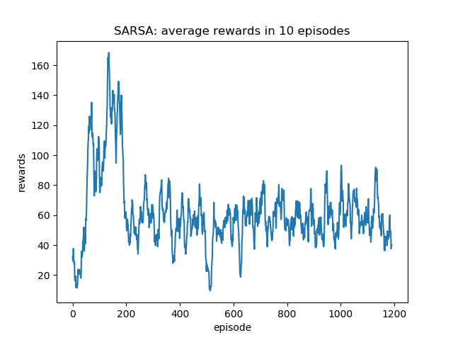
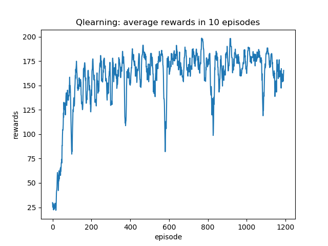
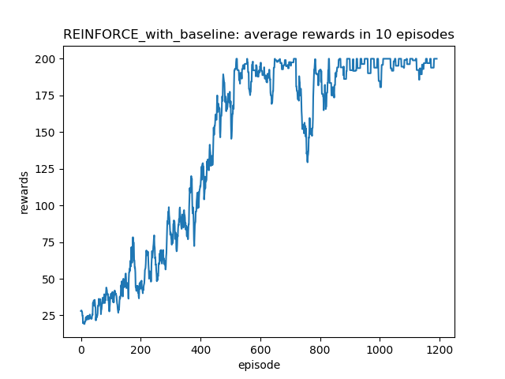
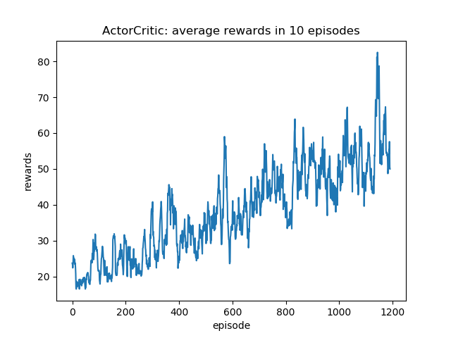
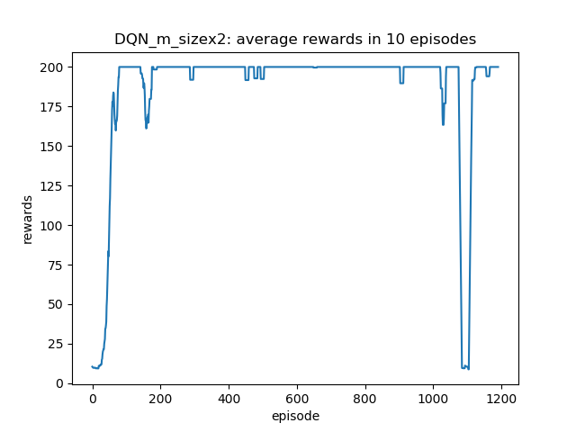

# RL Zoo

This repository is a collection of RL algorithms. (e.g., SARSA, Q Learning, DQN, REINFORCE, Actor-Critic)


## Requirements
Python > 3.7 \
PyTorch > 1.0 \
OpenAIGym > 0.17.2 \
JSAnimation \
IPython \

## Running the Code
### Directory structure
```
.
+---fig (demo files)
+---models (a set of algorithms)
+---scripts (training hyperparameters)
+---utils (a set of utility functions)
+---results (result files)
train.py (training code)
```

### Training
```
./scripts/train_{the name of an agent}.sh
```

### Results




